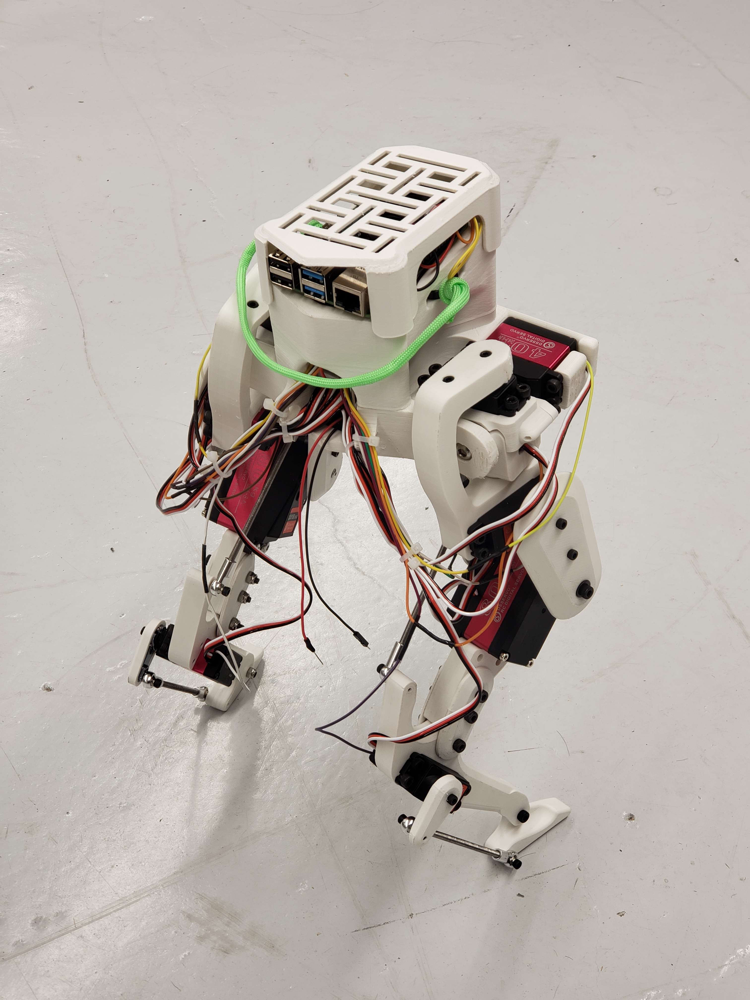

# Rob4RL - Robot for Reinforcement Learning

Rob4RL is a student project which aims to explore the feasibilty of low-cost bipedal robotics for the learning robust, sim2real applicable reinforcement learning based locomotion policies.

It has been built upon the work of David Ho, the original creator of the Legolas bipedal walker.

<p align="center">
  
  
</p>

## Repository Contents

This repository contains forked CAD and 3D printing files for Legolas.

It also contains small calibration/test python code snippets for I2C communication and test of the servos. Note that the current control code is only on prototype level - use with caution.

It will be updated regulary with the likes of model-based control, simulation testing and RL training code, likely in Isaac Sim/Lab.

Original Robot Design [Legolas Robot](https://github.com/daviddoo02/Legolas-an-open-source-biped/).

Original Robot Code [Legolas Controller](https://github.com/daviddoo02/Legolas_Controller).

## Getting Started

1. **Clone this repository:**

    ```bash
    git clone https://github.com/TEKG1t/Rob4RL.git
    ```

2. **Modify CAD or 3D Print the robot:**
  - Original SolidWorks files are provided in `Legolas/CAD` for modification
  - STL files are located in `Legolas/STLs` to 3D print your own robot, see assembly instuctions

3. **Assemble the robot**
  - See assembly instuctions

4. **TODO Next Steps**
  - Lets see if I am allowed to upload the intermediate milestone paper :)
  - Modified main body, actuator model for servos and model-based control

<p align="center">
  
</p>

## Required Materials

Original BOM with Amazon Links is shown in the original README of the Legolas Robot.

My Robot is using a Nvidia Jetson Orin Nano Super DevKit as Controller although a simple RL policy should be able to run on a raspy as well.

I am using 35kgcm instead of 40kgcm and 60kgcm instead of 80kgcm servos of similar standardized size because of hardware availability.

| **Type**      | **Specification** | **Value**                     |
|---------------|-------------------|-------------------------------|
|               | Height            | 50cm                          |
| General       | Weight            | 3kg                           |
|               | Material          | PLA                           |
|               | Cost              | 1500€                         |
|               | Name              | Nvidia Jetson Orin Nano       |
| Controller    | Storage           | 500GB NVME M.2                |
|               | 35kgcm Servo      | 8120MG 180°                   |
| Actuators     | 60kgcm Servo      | DS5160 SSG 270°               |
|               | Servo driver      | PCA9685                       |
| Sensors       | IMU               | MPU6050                       |

Note: General Robot values are estimates for now.

## Assembly Instruction

This section summarizes the assembly of one Legolas left leg.  

### 3D Printing BOM
Start by printing the STL files under `Legolas/STLs`. Some parts need to be mirrored for the right leg. Optional TPU shoes can be added for extra grip.

| **Part Name**             | **Amount** | **Mirror for right leg** |
|----------------------------|------------|---------------------------|
| Main body.stl              | 1          |                           |
| Hip 1 A.stl                | 1          | x                         |
| Hip 1 B.stl                | 1          | x                         |
| Hip 2.stl or Pitch A + B   | 1          | x                         |
| Thigh Inner.stl            | 1          |                           |
| Thigh Outer.stl            | 1          |                           |
| Foreleg A.stl              | 1          | x                         |
| Foreleg B + C.stl          | 1          |                           |
| Shin.stl                   | 1          |                           |
| Servo Cover.stl            | 1          |                           |
| Foot.stl                   | 1          | x                         | 

Recommended print settings (I used Cura):
- Walls: min 4 lines for strength  
- Infill: slightly higher than default  
- Wall order: inside → outside  

One leg weighs ~184g, takes ~15h to print, and ~2–3h to assemble.  

### Servo & Mechanical Assembly
Each leg uses:
- 3 × 40 kg·cm servos (hip)  
- 1 × 80 kg·cm servo (knee)  
- 1 × 40 kg·cm servo (foot)  

Prototype tested with 35 kg·cm and 60 kg·cm servos (still compatible).  
Cut threaded rods to:  
- 85 mm (upper transmission bar)  
- 80 mm (lower bar)  

Refer to the hardware BOM for screws, nuts, and bearings.
All screws default to cylinder head unless specified. Slight over-provisioning ensures successful assembly during prototyping. The original designer recommends purchasing a metric nuts and bolts assortment kit.

| **Amount** | **Part Name**              | **Usage**                          |
|------------|-----------------------------|------------------------------------|
| 6          | AXK0619 Bearings            | Joints                             |
| 4          | M4 ball rod ends            | Joint transmission                 |
| 2          | M4 threaded rod             | Joint transmission; cut to length  |
| 5          | M3x8                        | Servo shaft to servo               |
| 5          | M3x10                       | Servo shaft to print               |
| 4          | M3x16                       | Hip 2 A+B                          |
| 1          | M3x20                       | Foot servo shaft                   |
| 1          | M3x25 drop forge screw      | Hip-thigh rod                      |
| 16         | M4x12                       | 35kgcm servo mounting              |
| 2          | M4x20                       | Passive hip-thigh joint            |
| 2          | M4x35                       | Foreleg-shin joint                 |
| 1          | M4x40                       | Final foreleg-shin joint           |
| 4          | M5x12                       | 60kgcm servo mounting              |
| 1          | M6x16                       | Hip joint                          |
| 1          | M6x16 drop forge screw      | Hip joint                          |
| 2          | M3 locking nuts             | Shaft and joint locking            |
| 5          | M4 locking nuts             | Transmission/bar locking           |
| 6–11       | M4 nuts                     | Transmission/bar locking           |
| 2          | M6 locking nuts             | Hip joint mounting                 |
| 3          | M3 washers                  | Passive joint load distribution    |
| 1          | M4 washer                   | Passive joint load distribution    |

Use zip ties or wraps for cable management. See assembly image for reference.  

<p align="center">
  
</p>

## License

This project is licensed under the MIT License - see the [LICENSE](LICENSE) file for details.

## Acknowledgments

- Thanks to Berkeley Humanoid (Lite) projects which inspired this research
- Thanks to David Ho, the original creator of the Legolas robot
- The Legolas robot is inspired by the Cassie robot by Agility Robotics.
